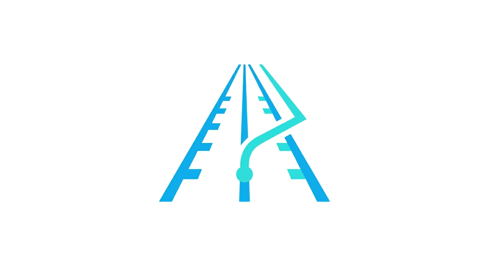

<h1 style="color: #00ACED; margin-top: -4rem">openRoad</h1>

> Minimalist roadmap visualizer for GitHub Organizations.

## Overview

openRoad provides a high-level, interactive roadmap view of your GitHub projects. It aggregates milestones from personal repositories or entire organizations into a clean, horizontal timeline with automated status intelligence.

## Documentation

- [Getting Started](./docs/getting-started.md)
- [Architecture & Design](./docs/superpowers/specs/2026-04-12-openroad-design.md)
- [Implementation Plan](./docs/superpowers/plans/2026-04-12-openroad-implementation.md)

---

  
   
  Developed by Golive. Licensed under the MIT License.

